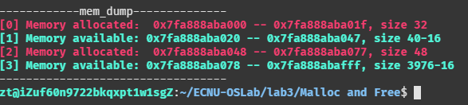

# 操作系统实践第二次实验报告

## Project 2a: Malloc and Free

### Objectives

1.  To understand the nuances of building a memory allocator.
2.  To do so in a performance-efficient manner.
3.  To create a shared library.


### 基本思路

1.  实用 `mmap()` 一次性请求一部分空间
2.  用这一部分连续空间分别实用 3 种不同方法分配内存
3.  实现内存回收，和相邻的空余内存合并成新的内存
4.  实现 `mem_dump` 方便调试，输出分配信息
5.  引入报错机制
6.  将该内存分配做成库函数

### 维护一个 free list

我们需要维护内存分配操作和内存删除操作。有两个思路

1.  使用链表 Node 维护空余空间，使用 Header 维护分配空间
2.  使用 MCB 维护空余空间和分配空间

实际效果使用链表运行速度在随机测试下稍快，这里使用第一种思路


#### 申请空间

`mmap` 的 manual page：

```c
NAME
       mmap, munmap - map or unmap files or devices into memory
SYNOPSIS
       #include <sys/mman.h>

       void *mmap(void *addr, size_t length, int prot, int flags,
                  int fd, off_t offset);
       int munmap(void *addr, size_t length);

       See NOTES for information on feature test macro requirements.
```

作用为映射一段内存到文件上，我们读写文件时相应内存空间会发生变化，而读写内存时文件也会随之同步。这里我们只是需要获取一段内存，在 `flags` 参数内添加 `MAP_PRIVATE` 表示内存是私有的不可被其他程序修改，且将内存映射到 `/dev/zero` 的 file descriptor 上，该文件可看作一个无限大小的只包含 NULL 内容的文件（随便找来的一个无意义的文件，相当于我们把拿来的内存隐藏起来。当然也可以在 `prot` 参数加入 `MAP_ANONYMOUS`，功能等效。

实用 `getpagesize()` 获取页表大小，将预分配空间对其上取整，然后我们就能拿到一大段内存了。

出于性能考虑分配的内存大小和节点大小都要是 8 的倍数，这里仿照 `xv6` 的风格，使用 `union` 将一个 `struct` 链表节点和 `long` 类型绑定，使得 `sizeof(Node)` 为 8 的倍数


```c
typedef long Align;

union node {
    struct {
        union node *next;
        uint size;
    } s;
    Align x;
};

union header {
    struct {
        union header *next;
        uint size, magic;
    } s;
    Align x;
};

```

#### 维护空余空间列表


##### 分配空间

考虑用户为指针分配内存和回收内存空间的过程，当用户分配内存时，会指定内存需求的大小，链表的节点当然要记录每段空间的大小。以下是链表节点的定义

```c
union node {
    struct {
        union node *next;
        uint size;
    } s;
    Align x;
};
```


#### 内存分配算法

如果说一个空间能满足分配要求 （包括 `Header` 的大小加上用户请求的空间），我们说这个空间是可分配的。要求实现三种分配算法，模拟一下就行了。

##### First fit

使用第一个可分配的空间

##### Best fit

使用可分配空间中最小的

##### Worst fit

使用可分配空间中最大的

##### xv6 flavor

阅读 xv6 代码，发现其实现的内存分配算法均不是上述三种，而是贪心的选择上一个已经分配过的区间的剩余容量去继续分配。这实际上可能是比较不错的思路，特别是对于连续分配一系列很小的内存空间，可能一段空间就能满足很多很多请求，这样我们就无需对每次请求都遍历一边链表

#### 回收空间

当用户回收内存时，只会提供需要释放的内存。因此我们得为用户维护每段内存的指定大小，这一部分也需要占用内存，也就是说用户最后得到的空间一定会小于我们申请到的空间。用于记录分配内存大小的结构体为 `Header`

```c
union header {
    struct {
        union header *next;
        uint size, magic;
    } s;
    Align x;
};
```

为了方便起见我们把分配的内存和这个 `header` 放在一起，这样拿到指针我们不需要额外的空间去找 `header` 在哪里

如果用户提交了错误的内存需要释放怎么办？如果是不小心清空了链表结构，那整个内存管理可就乱了套。这里的解决方案是引入 `magic` 位，当它等于一个特定的常量，我们有理由相信这段内存之前有我们之前分配好的 `Header`，否则它就是胡乱交上来的一个捣乱指针，此时设置 `m_error` 错误标记为 `E_BAD_POINTER`


```c
#define MAGIC 0x19260817

Header *p = (void*)ptr - sizeof(Header);
if (p->s.magic != MAGIC) {
    m_error = E_BAD_POINTER;
    return;
}
```

#### 合并空余空间

删除的时候可以合并空间，我们需要知道相邻的空余空间。我在构思的时候想到了两种方案

假设当前有 $n$ 个空余节点，$m$ 个已分配的节点。在空间占用方面单向链表的节点大小要比双向链表多出 8 个字节（sizeof(void*) 在 64 位机器上是 8 个字节)。

+ 使用双向链表，一起链接 `Header` 和 `Node`，在对齐 8个字节的情况下在 64 位机器上两种节点内存均为 24 字节。这样我们可以 $O(1)$ 找到相邻的空域内存（或者没有）。但是分配的复杂度变为 $O(m+n)$
+ 使用单向链表，和教材以及 xv6 的方式一样，每次遍历一遍链表寻找相邻的空间

考虑实际过程，每次内存分配都会对应有删除，因此 $\sum\limits_{i}{M_i} = \sum\limits_{j}{N_j}$ 两种方案耗费时间相差无几，节省内存考虑应该还是使用单项链表（虽然双向链表在合并的实现会稍微简洁一些）。

#### 错误处理

### 共享库

当程序与静态库连接时，库中目标文件所含的所有将被程序使用的函数的机器码被copy到最终的可执行文件中。这就会导致最终生成的可执行代码量相对变 多，相当于编译器将代码补充完整了，这样运行起来相对就快些。不过会有个缺点: 占用磁盘和内存空间. 静态库会被添加到和它连接的每个程序中,而且这些程序运行时, 都会被加载到内存中. 无形中又多消耗了更多的内存空间.

与共享库连接的可执行文件只包含它需要的函数的引用表，而不是所有的函数代码，只有在程序执行时,那些需要的函数代码才被拷贝到内存中。这样就使可执行文 件比较小,节省磁盘空间，更进一步，操作系统使用虚拟内存，使得一份共享库驻留在内存中被多个程序使用，也同时节约了内存。不过由于运行时要去链接库会花 费一定的时间，执行速度相对会慢一些，总的来说静态库是牺牲了空间效率，换取了时间效率，共享库是牺牲了时间效率换取了空间效率。

创建共享库的方法是先使用 `-fpic` 创建位置无关代码（全部使用相对地址，故可以在任意内存位置运行），然后使用 `-shared` 产生动态库。

makefile 如下：（假设所有代码均在 `mem.c` 中）

```sh
libmem.so : mem.o
	gcc -shared -o libmem.so mem.o
libmem.so : mem.o
	gcc -shared -o libmem.so mem.o
mem.o : mem.c
	gcc -c -fpic mem.c -Wall -Werror
clean : 
	rm -f *.o
	rm -f *.so
	rm -f main
	rm -f ./bin/*
test : mymain.c
	gcc -L. -o ./bin/test.out mymain.c -Wall -lmem
```

值得一提的是，在高版本的 gcc 编译器中可能需要将 `-l` 放到后面而不是作业要求中给出的样例那样，详情见 https://stackoverflow.com/questions/12748837/c-shared-library-undefined-reference-to-fooclasssayhello

当然我们还需要设置环境变量（假如需要运行的程序也在当前目录下）

```sh
export LD_LIBRARY_PATH=$LD_LIBRARY_PATH:.
```


### 运行测试 & 代码详解

#### mem_dump

逐条打印每一条空余空间或者是分配空间，格式如下：

```
[id] Memory allocated/available： %p -- %p, （size - 16）
```

* id 表示标号从零开始
* allocated 表示已分配，使用红色文字
* available 表示可用，大小减去 Header 大小表示真正可用空间，使用绿色文字


改变终端颜色，linux 终端颜色可以通过打印特殊字符改变
```c

//------------------ some tricks
#define setgreen fprintf(stderr, "\033[32;1m")
#define setwhite fprintf(stderr, "\033[39;0m")
#define setred fprintf(stderr, "\033[31;1m")
#define setblue fprintf(stderr, "\033[34;1m")
#define setyellow fprintf(stderr, "\033[33;1m")
```

如果没有成功运行过一次 `mem_init`

```
Oops, you haven't successfully called mem_init yet.
```

如果全部空间均被占用

```
Oops, it seems that all space has been allocated.
```

打印区块信息

```c
int memdump_id;
void dblock(void *l, void *r, int is_free)
{
    printf("[%d] ", memdump_id++);
    if (is_free)
    {
        setgreen;
        printf("Memory available: ");
        printf("%p -- %p, size %lu-%lu\n", l, r - 1, r - l, sizeof(Node));
    }
    else
    {
        setred;
        printf("Memory allocated： ");
        printf("%p -- %p, size %lu\n", l, r - 1, r - l);
    }

    setwhite;
}

`mem_dump` 函数

void mem_dump()
{

    printf("------------mem_dump--------------\n");
    if (!called)
    {
        setred;
        printf("Oops, you haven't successfully called mem_init yet.\n");
        setwhite;
    }
    else if (base == NULL)
    {
        setred;
        printf("Oops, it seems that all space has been allocated.\n");
        setwhite;
    }
    else
    {
        memdump_id = 0;
        if (ptr < (void *)base)
        {
            dblock(ptr, base, 0);
        }
        Node *p, *prevp = NULL;
        for (p = base; p != NULL; prevp = p, p = p->s.next)
        {
            if (prevp != NULL)
                dblock((void *)prevp + sizeof(Node) + prevp->s.size, p, 0);
            dblock((void *)p, (void *)p + sizeof(Node) + p->s.size, 1);
        }
    }

    printf("----------------------------------\n");
}
```

##### 实际效果


#### mem_init

一些全局变量

```c
static Node *base;
int m_error;
static int called = 0;
void *ptr;
```

* base：空余节点的链表头指针
* m_error：错误标志
* called：成功的 `mem_init` 计数
* ptr：使用 `mmap` 分配的空间


如果调用 `mem_init` 超过两次或者空间小于等于 0 则返回错误，否则对页表大小对齐

```c
int mem_init(int size_of_region)
{

    if (size_of_region <= 0 || called)
    {
        m_error = E_BAD_ARGS;
        return -1;
    }

    const int PAGE_SIZE = getpagesize();
    size_of_region = (size_of_region + PAGE_SIZE - 1) / PAGE_SIZE * PAGE_SIZE;
```

调用 `mmap`，如果结果错误，则返回错误；否则增加成功调用计数初始化链表。实际大小需要减去 Node 大小

```c

    int fd = open("/dev/zero", O_RDWR);

    // size_of_region (in bytes) needs to be evenly divisible by the page size
    ptr = mmap(NULL, size_of_region, PROT_READ | PROT_WRITE, MAP_PRIVATE, fd, 0);

    if (ptr == MAP_FAILED)
    {
        m_error = E_BAD_ARGS;
        return -1;
    }

    ++called;

    // initialize the link list, the first node is a node_t
    base = (Node *)ptr;
    setNode(base, size_of_region - sizeof(Node));

    // close the device (don't worry, mapping should be unaffected)
    close(fd);
    return 0;
}
```