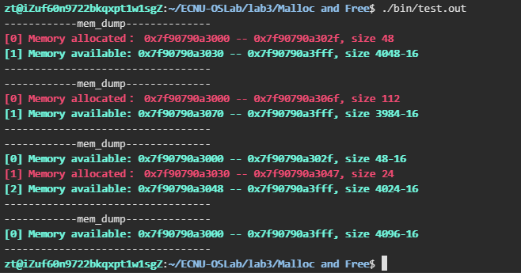
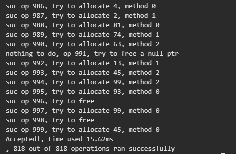
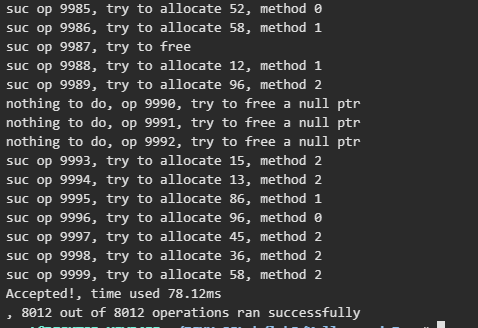
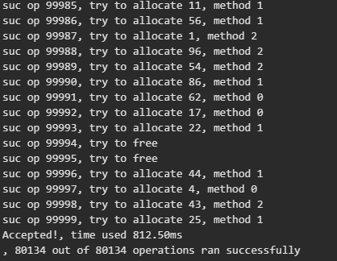
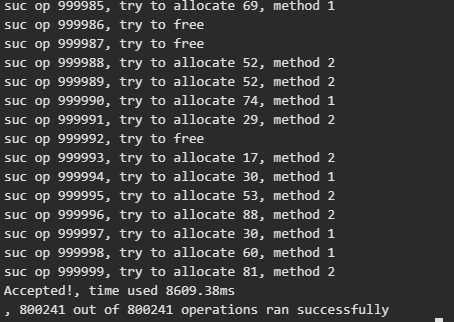

# 操作系统实践第二次实验报告

## Project 2a: Malloc and Free

### Objectives

1.  To understand the nuances of building a memory allocator.
2.  To do so in a performance-efficient manner.
3.  To create a shared library.

### 文件结构

* mem.c 主要代码文件
* mymain.c 基本测试文件
* makefile
* libconf 环境变量设置
* ran.c 随机测试文件

### 用法

```sh
make clean
make

export LD_LIBRARY_PATH=$LD_LIBRARY_PATH:. # 设置环境变量（运行当前目录下程序）

make test # 基本测试
./bin/test.out

make random # 随机测试
./bin/test.out [随机种子] [操作数量] [分配空间] # ./bin/test.out 123 1000 100000
```

### 基本思路

1.  实用 `mmap()` 一次性请求一部分空间
2.  用这一部分连续空间分别实用 3 种不同方法分配内存
3.  实现内存回收，和相邻的空余内存合并成新的内存
4.  实现 `mem_dump` 方便调试，输出分配信息
5.  引入报错机制
6.  将该内存分配做成库函数

### 维护一个 free list

我们需要维护内存分配操作和内存删除操作。有两个思路

1.  使用链表 Node 维护空余空间，使用 Header 维护分配空间
2.  使用 MCB 维护空余空间和分配空间

实际效果使用链表运行速度在随机测试下稍快，这里使用第一种思路


#### 申请空间

`mmap` 的 manual page：

```c
NAME
       mmap, munmap - map or unmap files or devices into memory
SYNOPSIS
       #include <sys/mman.h>

       void *mmap(void *addr, size_t length, int prot, int flags,
                  int fd, off_t offset);
       int munmap(void *addr, size_t length);

       See NOTES for information on feature test macro requirements.
```

作用为映射一段内存到文件上，我们读写文件时相应内存空间会发生变化，而读写内存时文件也会随之同步。这里我们只是需要获取一段内存，在 `flags` 参数内添加 `MAP_PRIVATE` 表示内存是私有的不可被其他程序修改，且将内存映射到 `/dev/zero` 的 file descriptor 上，该文件可看作一个无限大小的只包含 NULL 内容的文件（随便找来的一个无意义的文件，相当于我们把拿来的内存隐藏起来。当然也可以在 `prot` 参数加入 `MAP_ANONYMOUS`，功能等效。

实用 `getpagesize()` 获取页表大小，将预分配空间对其上取整，然后我们就能拿到一大段内存了。

出于性能考虑分配的内存大小和节点大小都要是 8 的倍数，这里仿照 `xv6` 的风格，使用 `union` 将一个 `struct` 链表节点和 `long` 类型绑定，使得 `sizeof(Node)` 为 8 的倍数


```c
typedef long Align;

union node {
    struct {
        union node *next;
        uint size;
    } s;
    Align x;
};

union header {
    struct {
        union header *next;
        uint size, magic;
    } s;
    Align x;
};

```

#### 维护空余空间列表


##### 分配空间

考虑用户为指针分配内存和回收内存空间的过程，当用户分配内存时，会指定内存需求的大小，链表的节点当然要记录每段空间的大小。以下是链表节点的定义

```c
union node {
    struct {
        union node *next;
        uint size;
    } s;
    Align x;
};
```


#### 内存分配算法

如果说一个空间能满足分配要求 （包括 `Header` 的大小加上用户请求的空间），我们说这个空间是可分配的。要求实现三种分配算法，模拟一下就行了。

##### First fit

使用第一个可分配的空间

##### Best fit

使用可分配空间中最小的

##### Worst fit

使用可分配空间中最大的

#### 回收空间

当用户回收内存时，只会提供需要释放的内存。因此我们得为用户维护每段内存的指定大小，这一部分也需要占用内存，也就是说用户最后得到的空间一定会小于我们申请到的空间。用于记录分配内存大小的结构体为 `Header`

```c
union header {
    struct {
        union header *next;
        uint size, magic;
    } s;
    Align x;
};
```

为了方便起见我们把分配的内存和这个 `header` 放在一起，这样拿到指针我们不需要额外的空间去找 `header` 在哪里

如果用户提交了错误的内存需要释放怎么办？如果是不小心清空了链表结构，那整个内存管理可就乱了套。这里的解决方案是引入 `magic` 位，当它等于一个特定的常量，我们有理由相信这段内存之前有我们之前分配好的 `Header`，否则它就是胡乱交上来的一个捣乱指针，此时设置 `m_error` 错误标记为 `E_BAD_POINTER`


```c
#define MAGIC 0x19260817

Header *p = (void*)ptr - sizeof(Header);
if (p->s.magic != MAGIC) {
    m_error = E_BAD_POINTER;
    return;
}
```

#### 合并空余空间

删除的时候可以合并空间，我们需要知道相邻的空余空间。我在构思的时候想到了两种方案

假设当前有 $n$ 个空余节点，$m$ 个已分配的节点。在空间占用方面单向链表的节点大小要比双向链表多出 8 个字节（sizeof(void*) 在 64 位机器上是 8 个字节)。

+ 使用双向链表，一起链接 `Header` 和 `Node`，在对齐 8个字节的情况下在 64 位机器上两种节点内存均为 24 字节。这样我们可以 $O(1)$ 找到相邻的空域内存（或者没有）。但是分配的复杂度变为 $O(m+n)$
+ 使用单向链表，和教材以及 xv6 的方式一样，每次遍历一遍链表寻找相邻的空间

考虑实际过程，每次内存分配都会对应有删除，因此 $\sum\limits_{i}{M_i} = \sum\limits_{j}{N_j}$ 两种方案耗费时间相差无几，节省内存考虑应该还是使用单项链表（虽然双向链表在合并的实现会稍微简洁一些）。

#### 错误处理

### 共享库

当程序与静态库连接时，库中目标文件所含的所有将被程序使用的函数的机器码被copy到最终的可执行文件中。这就会导致最终生成的可执行代码量相对变 多，相当于编译器将代码补充完整了，这样运行起来相对就快些。不过会有个缺点: 占用磁盘和内存空间. 静态库会被添加到和它连接的每个程序中,而且这些程序运行时, 都会被加载到内存中. 无形中又多消耗了更多的内存空间.

与共享库连接的可执行文件只包含它需要的函数的引用表，而不是所有的函数代码，只有在程序执行时,那些需要的函数代码才被拷贝到内存中。这样就使可执行文 件比较小,节省磁盘空间，更进一步，操作系统使用虚拟内存，使得一份共享库驻留在内存中被多个程序使用，也同时节约了内存。不过由于运行时要去链接库会花 费一定的时间，执行速度相对会慢一些，总的来说静态库是牺牲了空间效率，换取了时间效率，共享库是牺牲了时间效率换取了空间效率。

创建共享库的方法是先使用 `-fpic` 创建位置无关代码（全部使用相对地址，故可以在任意内存位置运行），然后使用 `-shared` 产生动态库。

makefile 如下：（假设所有代码均在 `mem.c` 中）

```sh
libmem.so : mem.o
	gcc -shared -o libmem.so mem.o
libmem.so : mem.o
	gcc -shared -o libmem.so mem.o
mem.o : mem.c
	gcc -c -fpic mem.c -Wall -Werror
clean : 
	rm -f *.o
	rm -f *.so
	rm -f main
	rm -f ./bin/*
test : mymain.c
	gcc -L. -o ./bin/test.out mymain.c -Wall -lmem
```

值得一提的是，在高版本的 gcc 编译器中可能需要将 `-l` 放到后面而不是作业要求中给出的样例那样，详情见 https://stackoverflow.com/questions/12748837/c-shared-library-undefined-reference-to-fooclasssayhello

当然我们还需要设置环境变量（假如需要运行的程序也在当前目录下）

libconf:
```sh
export LD_LIBRARY_PATH=$LD_LIBRARY_PATH:.
```


### 运行测试 & 代码详解

#### mem_dump

逐条打印每一条空余空间或者是分配空间，格式如下：

```
[id] Memory allocated/available： %p -- %p, （size - 16）
```

* id 表示标号从零开始
* allocated 表示已分配，使用红色文字
* available 表示可用，大小减去 Header 大小表示真正可用空间，使用绿色文字


改变终端颜色，linux 终端颜色可以通过打印特殊字符改变
```c

//------------------ some tools
#define setgreen fprintf(stderr, "\033[32;1m")
#define setwhite fprintf(stderr, "\033[39;0m")
#define setred fprintf(stderr, "\033[31;1m")
#define setblue fprintf(stderr, "\033[34;1m")
#define setyellow fprintf(stderr, "\033[33;1m")
```

如果没有成功运行过一次 `mem_init`

```
Oops, you haven't successfully called mem_init yet.
```

如果全部空间均被占用

```
Oops, it seems that all space has been allocated.
```

打印区块信息

```c
int memdump_id;
void dblock(void *l, void *r, int is_free)
{
    printf("[%d] ", memdump_id++);
    if (is_free)
    {
        setgreen;
        printf("Memory available: ");
        printf("%p -- %p, size %lu-%lu\n", l, r - 1, r - l, sizeof(Node));
    }
    else
    {
        setred;
        printf("Memory allocated： ");
        printf("%p -- %p, size %lu\n", l, r - 1, r - l);
    }

    setwhite;
}

`mem_dump` 函数

void mem_dump()
{

    printf("------------mem_dump--------------\n");
    if (!called)
    {
        setred;
        printf("Oops, you haven't successfully called mem_init yet.\n");
        setwhite;
    }
    else if (base == NULL)
    {
        setred;
        printf("Oops, it seems that all space has been allocated.\n");
        setwhite;
    }
    else
    {
        memdump_id = 0;
        if (ptr < (void *)base)
        {
            dblock(ptr, base, 0);
        }
        Node *p, *prevp = NULL;
        for (p = base; p != NULL; prevp = p, p = p->s.next)
        {
            if (prevp != NULL)
                dblock((void *)prevp + sizeof(Node) + prevp->s.size, p, 0);
            dblock((void *)p, (void *)p + sizeof(Node) + p->s.size, 1);
        }
    }

    printf("----------------------------------\n");
}
```

##### 实际效果


#### mem_init

一些全局变量

```c
static Node *base;
int m_error;
static int called = 0;
void *ptr;
```

* base：空余节点的链表头指针
* m_error：错误标志
* called：成功的 `mem_init` 计数
* ptr：使用 `mmap` 分配的空间


如果调用 `mem_init` 超过两次或者空间小于等于 0 则返回错误，否则对页表大小对齐

```c
int mem_init(int size_of_region)
{

    if (size_of_region <= 0 || called)
    {
        m_error = E_BAD_ARGS;
        return -1;
    }

    const int PAGE_SIZE = getpagesize();
    size_of_region = (size_of_region + PAGE_SIZE - 1) / PAGE_SIZE * PAGE_SIZE;
```

调用 `mmap`，如果结果错误，则返回错误；否则增加成功调用计数初始化链表。实际大小需要减去 Node 大小

```c

    int fd = open("/dev/zero", O_RDWR);

    // size_of_region (in bytes) needs to be evenly divisible by the page size
    ptr = mmap(NULL, size_of_region, PROT_READ | PROT_WRITE, MAP_PRIVATE, fd, 0);

    if (ptr == MAP_FAILED)
    {
        m_error = E_BAD_ARGS;
        return -1;
    }

    ++called;

    // initialize the link list, the first node is a node_t
    base = (Node *)ptr;
    setNode(base, size_of_region - sizeof(Node));

    // close the device (don't worry, mapping should be unaffected)
    close(fd);
    return 0;
}
```

#### mem_alloc

先验证是否成功调用过 mem_init

使用 long 作为对齐，对分配内存的要求先对 8 字节对齐，然后计算总共需要的空间。

```c
typedef long long Align;
typedef unsigned uint;
typedef unsigned long long ULL;

void *mem_alloc(int size, int style)
{
    if (!called)
    {
        m_error = E_BAD_ARGS;
        return NULL;
    }

    size = (size + sizeof(Align) - 1) / sizeof(Align) * sizeof(Align);

    uint need = size + sizeof(Header);
```

根据参数选择调度算法，遍历一边链表。由于是单向链表，我们删除节点同时也需要前一个节点的引用

* n 选择插入的节点
* prevp 前一个节点

```c
    Node *n = NULL, *prevp = NULL, *cn = NULL, *cp = NULL;
    uint bestsize;

    switch (style)
    {
    case M_FIRSTFIT:
        for (n = base; n != NULL; prevp = n, n = n->s.next)
        {
            if (n->s.size + sizeof(Node) >= need)
            {
                break;
            }
        }
        break;

    case M_BESTFIT:
        cn = NULL;
        cp = NULL;
        bestsize = 0xffffffff;
        for (cn = base; cn != NULL; cp = cn, cn = cn->s.next)
        {
            if (cn->s.size < bestsize && cn->s.size + sizeof(Node) >= need)
            {
                n = cn;
                prevp = cp;
                bestsize = n->s.size;
            }
        }
        break;

    case M_WORSTFIT:
        dprintf("In M_WORSTFIT, need = %d, base = %p\n", need, base);
        cn = NULL;
        cp = NULL;
        bestsize = 0;
        for (cn = base; cn != NULL; cp = cn, cn = cn->s.next)
        {
            if (cn->s.size > bestsize && cn->s.size + sizeof(Node) >= need)
            {
                n = cn;
                prevp = cp;
                bestsize = n->s.size;
            }
        }
        break;
    default:
        break;
    }

```

如果没找到合适的 n 说明空间不足。然后查看剩余空间是否还能插入一个空余空间的节点，至少需要一个 Node 的大小和 8 个字节（最小的内存分配空间）

最后是设置 Header，返回位置。由于我们将 Header 和分配的空间挨在一起，可以通过指针地址运算计算出位置

```c
    if (n == NULL)
    {
        m_error = E_NO_SPACE;
        return NULL;
    }
    uint remain = n->s.size + sizeof(Node) - need;
    Node *newnode;
    if (remain >= sizeof(Node) + sizeof(Align))
    {
        newnode = (void *)n + need;
        setNode(newnode, n->s.size - need);
        connect(newnode, n->s.next);
    }
    else
    {
        newnode = n->s.next;
    }

    if (prevp == NULL)
    {
        base = newnode;
    }
    else
    {
        connect(prevp, newnode);
    }

    Header *h = (Header *)n;
    setHeader(h, size);

    return (void *)h + sizeof(Header);
}
```

#### mem_free

这里释放内存和合并空间也写在一起了

首先检查是否调用过 `mem_init()` 和 Header 校验

```c
int mem_free(void *ptr)
{
    if (!called)
    {
        m_error = E_BAD_ARGS;
        return -1;
    }
    Header *p = (void *)ptr - sizeof(Header);
    if (p->s.magic != MAGIC)
    {
        m_error = E_BAD_POINTER;
        return -1;
    }
```

然后遍历一遍链表找出左边相邻的空余区间和右边的


```c
    Node *t = ptr - sizeof(Header);
    setNode(t, p->s.size + sizeof(Header) - sizeof(Node));

    // merge with left
    Node *lp = NULL, *rp = NULL;
    for (Node *n = base; n != NULL; n = n->s.next)
    {
        if ((void *)n + n->s.size + sizeof(Header) <= (void *)t)
        {
            lp = n;
        }
        else
        {
            rp = n;
            break;
        }
    }
```

* 判断是否会生成新的口语区间头节点，得到新的头节点
* 判断是否相邻，如果是，先合并左边的区间，更改对应的大小
* 否则，在两个区间中插入新的区间

```c
    if (lp == NULL)
    {
        connect(t, base);
        base = t;
    }
    else if ((void *)lp + sizeof(Node) + lp->s.size == t)
    {
        lp->s.size += sizeof(Node) + t->s.size;
        t = lp;
    }
    else
    {
        connect(t, rp);
        connect(lp, t);
    }
```

* 如果右边的区间也相邻，则删去右边区间，并且合并

```c
    if (rp != NULL && (void *)t + sizeof(Node) + t->s.size == rp)
    {
        t->s.size += sizeof(Node) + rp->s.size;
        connect(t, rp->s.next);
    }
    return 0;
}
```


#### 测试

##### 基础测试

包含基本的内存分配，错误处理，空间合并

makefile 配置：

```sh
test : mymain.c
	mkdir -p bin
	gcc -L. -o ./bin/test.out mymain.c -Wall -lmem
```

mymain.c 代码：

```c
#include <assert.h>
#include <stdlib.h>
#include <stdio.h>
#include "mem.h"

int main()
{
    mem_init(4090);
    mem_init(4096);
    assert(m_error == E_BAD_ARGS);


    int *a = mem_alloc(sizeof(int) * 8, M_BESTFIT);
    a[7] = 1;
    mem_dump();

    char *b = mem_alloc(7, M_FIRSTFIT); // align to 8
    char *c = mem_alloc(4080, M_WORSTFIT);
    assert(m_error == E_NO_SPACE);
    c = mem_alloc(20, M_WORSTFIT);
    mem_dump();

    mem_free(a);
    mem_free(c);
    mem_dump();

    mem_free((void*)b+1);
    assert(m_error == E_BAD_POINTER);

    mem_free(b);
    mem_dump();

    exit(0);
}

```

效果截图：



#### 随机数据测试

思路：同时维护两个类似指针数组，每次随机挑选一个指针进行 alloc + write 或者 free 操作。在全部操作做完之后比较内存内容，使用 stdlib.h 中的 malloc 和 free 进行对拍。

makefile:

```sh
random: random.c
	mkdir -p bin
	gcc -L. -o ./bin/test.out ran.c -Wall -lmem
```

ran.c
```c
#include "mem.h"
#include <stdio.h>
#include <stdlib.h>
#include <string.h>
#include <time.h>
#include <assert.h>
#define N 500 // hash table size
#define MAXS 100 // max allocate size

//------------------ some tools
#define setgreen fprintf(stderr, "\033[32;1m")
#define setwhite fprintf(stderr, "\033[39;0m")
#define setred fprintf(stderr, "\033[31;1m")
#define setblue fprintf(stderr, "\033[34;1m")
#define setyellow fprintf(stderr, "\033[33;1m")

// #define DEBUG

#ifdef DEBUG
#define dprintf(x...) fprintf(stderr, ##x)
#else
#define dprintf(...)
#endif
//------------------------------

char *pos[N], *std[N]; // test ptr table & std ptr table (using malloc in stdlib.h)
int size[N], m_error; // sizeof ptr allocated

int main(int argc, char const *argv[])
{
    clock_t st = clock();
    int seed = atoi(argv[1]); // random seed
    int n = atoi(argv[2]);  // num of operations
    int totsize = atoi(argv[3]); 

    srand(seed);

    assert(mem_init(totsize) == 0);

    int m = N, suc = 0, fail = 0;
    for (int i=0; i<n; ++i) {
        int p = rand() % m;
        int alloc = rand()%5;

        if (!alloc) { // free 
            
            if (pos[p] != NULL) {
                assert(std[p] != NULL);
                assert(mem_free(pos[p]) == 0);
                free(std[p]);
                printf("suc op %d, try to free\n", i);
                pos[p] = std[p] = NULL;
            } else {
                printf("nothing to do, op %d, try to free a null ptr\n", i);
            }

        } else { // allocate
            if (pos[p] != NULL) {
                assert(std[p] != NULL);
                mem_free(pos[p]);
                free(std[p]);
                pos[p] = std[p] = NULL;
            }
            
            size[p] = rand() % 100 + 1;
            int method = rand()%3;
            pos[p] = mem_alloc(size[p] * sizeof(char), rand()%3);
            if (m_error == 0) {
                printf("suc op %d, try to allocate %d, method %d\n", i, size[p], method);
                ++suc;
                for (int j=0; j<size[p]-1; ++j)
                    pos[p][j] = rand()%26 + 'a';
                pos[p][size[p]-1] = 0;
                std[p] = malloc(size[p] * sizeof(char));
                memcpy(std[p], pos[p], size[p]); // make a copy in std
            } else {
                setred;
                printf("failed op %d, try to allocate %d, method %d\n", i, size[p], method); // failed to allocate
                setwhite;
                ++fail;
                m_error = 0;
            }
        }
    }

    for (int i=0; i<N; ++i) {
        if (pos[i] != NULL) {
            int ret = memcmp(pos[i], std[i], size[i]);
            if (ret) {
                puts("Wrong answer, memory illegal modified");
                return 0;
            }
        }
    }
    printf("Accepted!, time used %.2fms\n, %d out of %d operations ran successfully\n", (1.0 * clock() - st) / CLOCKS_PER_SEC * 1000, suc, suc+fail);
    return 0;
}

```

运行效果如下：

```sh
./bin/test.out 123 1000 100000
```

```sh
./bin/test.out 123 10000 100000
```

```sh
./bin/test.out 123 100000 100000
```

```sh
./bin/test.out 123 1000000 100000
```

