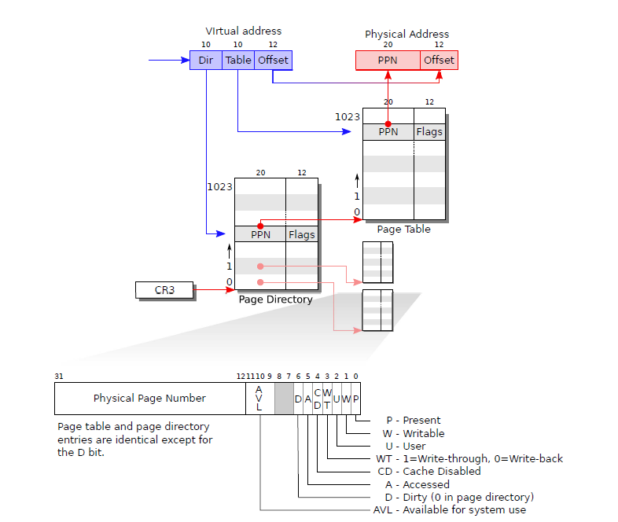
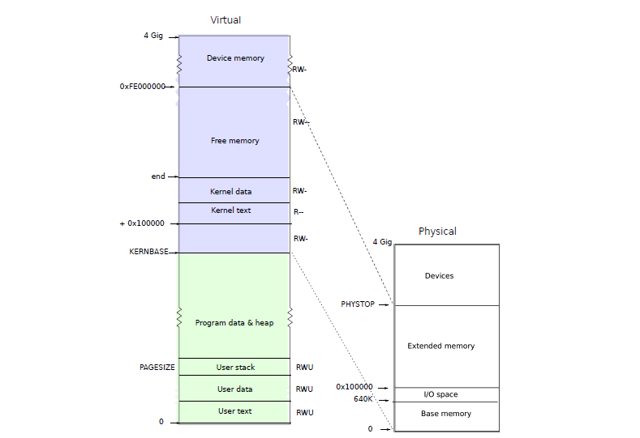

# 操作系统实践第三次实验报告

## Project 3b: xv6 VM Layout

### Part A: Null-pointer Dereference

#### Objectives

* 熟悉 xv6 虚拟内存系统
* 给 xv6 添加一些现代操作系统常有的功能


#### Steps

1.  找到原始 xv6 和 Linux 系统在访问空指针的区别
2.  理解 xv6 如何建立页表 (page table)，并且改动使其将前两页忽略 (unmapped)
3.  改进 xv6 使其能在访问空指针的时候使用 trap 并且 kill 掉进程

#### Difference between Linux and original xv6

首先设置 qemu 的路径（我的安装在 root 用户下，但是实际使用另一个账户运行，所以运行指令为 `sudo make qemu-nox`）

```sh
# If the makefile can't find QEMU, specify its path here
QEMU := /root/install/qemu-6.828-2.9.0/i386-softmmu/qemu-system-i386
```

编写一个程序，访问空指针，原代码见 `./xv6 VM Layout/user/nulldereference.c`

```c
#include "types.h"
#include "stat.h"
#include "user.h"

int main(int argc, char const *argv[])
{
    char *a;
    printf(1, "%d\n", *a);
    exit();
}
```


修改 `./xv6 VM Layout/user/makefile.mk`，添加我们编写的新程序

```sh
# user programs
USER_PROGS := \
	cat\
	echo\
	forktest\
	grep\
	init\
	kill\
	ln\
	ls\
	mkdir\
	rm\
	sh\
	stressfs\
	tester\
	usertests\
	wc\
	zombie\
	nulldereference # new program we add
```

结果如下，发现指针 `a` 指向未知的一串值

```sh
xv6...
lapicinit: 1 0xfee00000
cpu1: starting
cpu0: starting
init: starting sh
$ nulldereference
-115
$ 
```

当我们在 `Linux` 中运行类似的程序

```c
#include <stdio.h>

int main(int argc, char const *argv[])
{
    char *a;
    printf("%d\n", *a);
    return 0;
}
```

```sh
zt@iZuf60n9722bkqxpt1w1sgZ:~/ECNU-OSLab/lab4/test$ ./main
Segmentation fault
```

#### figuring out the outlook of xv6 VM

我们先来观察 `exec()` 函数，这个函数会创建一个新的进程运行指定程序。这个过程中将会给新程序分配内存空间，我们可以观察到新的一段虚拟内存空间是怎样被创建的

小技巧：使用 `visual studio code` 组合键 `Ctrl + 鼠标左键` 点击函数定义 (在 `./xv6 VM Layout/user/user.h`) 中可以快速定位函数实现在 `./xv6 VM Layout/kernel/exec.c`

##### page table

`xv6` 虚拟地址定义如下

32 位无符号地址被分为三个部分，第一个部分为 page directory index，第二部分为 page table index，第三部分表示 offset with page。这样每个页表构成 $2^{10}$ 个页表项，每个页表项有 $2^{12}$ 字节。然后我们也可以通过简单的位运算获取线性地址的这些部分。

回顾一下 x86 系统中使用两级树结构存放内存，每一级都是一个 1024 项的表，每一项是一个 32 位的数据，一般来说前 20 位表示物理地址的前 20 位，也就是我们要做的映射结果；后 12 位表示各种 flag。第一级存了1024个 page table，我们把这一级称为 page directory。因为每个 page table 正好有 1024x4=4096 大，前 20 位刚好可以表示一个 page table 的头，所以这里第一级的结构里面放的都是页表。第二级存放了 1024 项 physical page number(PPN) 这 20 位替换虚拟地址中的前二十位就是物理地址了。总的来说，虚拟地址替换为物理地址的步骤时，前 10 位在 page directory 中找到 page table，然后 10 位找到 PPN，最后替换虚拟地址的前 20 位。原理如下图所示



`./xv6 VM Layout/kernel/mmu.h`
```c
// A linear address 'la' has a three-part structure as follows:
//
// +--------10------+-------10-------+---------12----------+
// | Page Directory |   Page Table   | Offset within Page  |
// |      Index     |      Index     |                     |
// +----------------+----------------+---------------------+
//  \--- PDX(la) --/ \--- PTX(la) --/

// page directory index
#define PDX(la)		(((uint)(la) >> PDXSHIFT) & 0x3FF)

// page table index
#define PTX(la)		(((uint)(la) >> PTXSHIFT) & 0x3FF)

// construct linear address from indexes and offset
#define PGADDR(d, t, o)	((uint)((d) << PDXSHIFT | (t) << PTXSHIFT | (o)))
```

每个页表项需要一些 flag 设置他们的属性，比如说 Writeable 表示可以写入，Present 表示这个页表已经被用到了。还可以指定被当成缓存时的各种策略

`./xv6 VM Layout/kernel/mmu.h`
```c
// Page table/directory entry flags.
#define PTE_P		0x001	// Present
#define PTE_W		0x002	// Writeable
#define PTE_U		0x004	// User
#define PTE_PWT		0x008	// Write-Through
#define PTE_PCD		0x010	// Cache-Disable
#define PTE_A		0x020	// Accessed
#define PTE_D		0x040	// Dirty
#define PTE_PS		0x080	// Page Size
#define PTE_MBZ		0x180	// Bits must be zero
```

##### memory layout

xv6 使用如下的内存外貌



用户内存从 0 开始一直到 KERNBASE。在 `./xv6 VM Layout/include/types.h` 中我们看到 NULL 被定义为 0。因此一个空指针会访问到 User text 部分，这部分的页表 flag 上有 `Present` 因此会被认为是一个合法的内存访问。现在我们希望把前两页空出来，这样当前两页将没有 `Present` flag，访问的时候 kernel 就会帮我们处理错误。

于是我们的任务主要就是：使得程序 (User text) 从 0x2000 开始存放，留出两页的空间，涉及到的更改有：

* exec 执行程序会涉及到程序装载
* fork 复制出新的进程涉及到内存复制（程序装载）
* userinit 装载第一个用户程序需要特殊操作（涉及修改makefile)
* 修改相应的用户传入的地址的检查

##### Code: exec

exec 函数首先会检查 page table directory 是否设置，以及检查 elf header。不过我们的主要关注它如何分配内存

让我们先理解一些函数（无关紧要的细节已经被忽略）

`./xv6 VM Layout/kernel/kalloc.c kalloc` 该函数分配一个 4096 长度的物理内存空间
```
// Allocate one 4096-byte page of physical memory.
// Returns a pointer that the kernel can use.
// Returns 0 if the memory cannot be allocated.
char*
kalloc(void) {
	// ...
}
```

`./xv6 VM Layout/kernel/vm.c walkpgdir` 返回页表地址

```c
// Return the address of the PTE in page table pgdir
// that corresponds to linear address va.  If create!=0,
// create any required page table pages.
static pte_t *
walkpgdir(pde_t *pgdir, const void *va, int create) {
	// ...
}
```

`./xv6 Vm Layout/kernel/vm.c allocuvm` 为某个进程的页表分配新的空间，从 oldsz 增长到 newsz。需要注意的是，分配的方式从虚拟地址 0x00000000 开始，通过把内存大小转换成 16 进制地址恰好就是虚拟地址。

```c
// Allocate page tables and physical memory to grow process from oldsz to
// newsz, which need not be page aligned.  Returns new size or 0 on error.
int
allocuvm(pde_t *pgdir, uint oldsz, uint newsz)
{
  char *mem;
  uint a;

  if(newsz > USERTOP)
    return 0;
  if(newsz < oldsz)
    return oldsz;

  a = PGROUNDUP(oldsz);
  for(; a < newsz; a += PGSIZE){
    mem = kalloc();
    if(mem == 0){
      cprintf("allocuvm out of memory\n");
      deallocuvm(pgdir, newsz, oldsz);
      return 0;
    }
    memset(mem, 0, PGSIZE);
    mappages(pgdir, (char*)a, PGSIZE, PADDR(mem), PTE_W|PTE_U);
  }
  return newsz;
}
```

`./xv6 VM Layout/kernel/vm.c mappages` 该函数把会根据新分配的物理空间（4096长度）建立页表。也就是说会建立参数 la (虚拟地址) 到 pa (物理地址) 之间的映射。我们可以看到获取 `la` 的地址后会检查是否该地址已经被其他物理地址占用了（`panic("remap")`），否则就把 flag 加上 Present 一起添加。由之前的定义，相邻 page table directory 本来就有相邻的地址，如果这个 page table 满了自动就会应用到下一个 page table 中。（其实也可以看作是 $2^{20}$ 个连续页表）

```c
// Create PTEs for linear addresses starting at la that refer to
// physical addresses starting at pa. la and size might not
// be page-aligned.
static int
mappages(pde_t *pgdir, void *la, uint size, uint pa, int perm)
{
  char *a, *last;
  pte_t *pte;
  
  a = PGROUNDDOWN(la);
  last = PGROUNDDOWN(la + size - 1);
  for(;;){
    pte = walkpgdir(pgdir, a, 1);
    if(pte == 0)
      return -1;
    if(*pte & PTE_P)
      panic("remap");
    *pte = pa | perm | PTE_P;
    if(a == last)
      break;
    a += PGSIZE;
    pa += PGSIZE;
  }
  return 0;
}
```

这些虽然不是修改的地方，但是搞懂它们的意思很重要。让我们回到 `exec` 为新程序分配内存的地方

```c
// Load program into memory.
  sz = 0;
  for(i=0, off=elf.phoff; i<elf.phnum; i++, off+=sizeof(ph)){
    if(readi(ip, (char*)&ph, off, sizeof(ph)) != sizeof(ph))
      goto bad;
    if(ph.type != ELF_PROG_LOAD)
      continue;
    if(ph.memsz < ph.filesz)
      goto bad;
    if((sz = allocuvm(pgdir, sz, ph.va + ph.memsz)) == 0)
      goto bad;
    if(loaduvm(pgdir, (char*)ph.va, ip, ph.offset, ph.filesz) < 0)
      goto bad;
  }
  iunlockput(ip);
  ip = 0;
```

从 `sz=0` 开始然后再执行刚刚我们提到的 `allocuvm` 显然不是我们想要的结果，因为程序将从 0 开始装载而我们希望从 0x2000 开始，这里于是有两种思路

1.  更改 allocuvm 当中的 mappages，使所有的内存空间都向后位移 0x2000
2.  更改 exec，把程序的大小加大 0x2000

事实上一开始我才用前者的策略但是稍加思考后我个人偏向后者，因为 fork 的时候会根据 proc->sz 复制内存地址。显然改变 sz 会使得事情简单很多，否则几乎要在每一个 mappages 的地方都留意是否要做更改

于是我们有第一个更改的地方

```c
// sz = 0;
sz = 0x2000;
```

看起来有疑问的地方

```c
if((sz = allocuvm(pgdir, sz, ph.va + ph.memsz)) == 0)
  goto bad;
```

我们更改了初始 sz 的大小而没有懂 ph.va, ph.memsz，那么这里分配的内存会不会发生改变？其实不会，之后我们的更改会使得所有的用户程序 sz 都会增加保持一致性，使得这里留给程序的空间不会发生改变。

用户程序的装在位置在 `./xv6 Vm Layout/user/makefile.mk` 需要被更改

```c
# location in memory where the program will be loaded
USER_LDFLAGS += --section-start=.text=0x2000
```

总之，在这一部分我们确保 exec 执行的程序从 0x2000 开始存放


##### Code: fork

`fork` 函数会创建新的进程，这个过程中会复制出新的页表，这里有一个地方也需要更改


`./xv6 VM Layout/kernel/vm.c copyuvm`
```c
for(i = 0; i < sz; i += PGSIZE){
  if((pte = walkpgdir(pgdir, (void*)i, 0)) == 0)
    panic("copyuvm: pte should exist");
  if(!(*pte & PTE_P))
    panic("copyuvm: page not present");
  pa = PTE_ADDR(*pte);
  if((mem = kalloc()) == 0)
    goto bad;
  memmove(mem, (char*)pa, PGSIZE);
  if(mappages(d, (void*)i, PGSIZE, PADDR(mem), PTE_W|PTE_U) < 0)
    goto bad;
}
```

在之前我们让 sz 增大了 0x2000，因此这里复制地址看起来没什么问题，方便了许多。但是发现这里对每个在 sz 范围内的页表项都检查了必须要有 Present 标志，这就不是我们想要的了（前两页没有）。反正前两页我们不要，索性不复制了。这里就是第二个更改的地方

```c
// for(i = 0; i < sz; i += PGSIZE){
for (i=0x2000; i<sz; i += PGSIZE){
```


##### Code: creating the first process

这一部分 xv6 book 给出了很好的解释

第一个 user process 当然是我们的 shell 程序了，它可以在 `./xv6 Vm Layout/user/init.c` 当中被找到

第一个 user process 既不是 fork 出来的也不是某个 user process 调用 exec 而出来的，它是手动设置的。它会先执行 initcode.S 中的程序（当然也要从 0x2000开始），然后设置 trapframe 保留原始寄存器状态存放在 kernel stack 当中。从注释中我们发现，initCode 其实也是调用 exec 执行了 init 程序。我们让 userinit 的 eip 指向 initcode.S，设置进程状态为 RUNNABLE，然后交给 CPU 调度，准备让操作系统跑起来

于是我们要：

1.  为了保留一致性我们需要更改这个手动设置的进程大小
2.  esp 位置需要更改为进程大小
3.  eip 需要指向 initcode.S 的位置也就是 0x2000

第三个更改的地方：

```c
p = allocproc();
acquire(&ptable.lock);
initproc = p;
if((p->pgdir = setupkvm()) == 0)
  panic("userinit: out of memory?");
inituvm(p->pgdir, _binary_initcode_start, (int)_binary_initcode_size);
// p->sz = PGSIZE;
p->sz = PGSIZE + 0x2000;
memset(p->tf, 0, sizeof(*p->tf));
p->tf->cs = (SEG_UCODE << 3) | DPL_USER;
p->tf->ds = (SEG_UDATA << 3) | DPL_USER;
p->tf->es = p->tf->ds;
p->tf->ss = p->tf->ds;
p->tf->eflags = FL_IF;
// p->tf->esp = PGSIZE;
p->tf->esp = p->sz;
// p->tf->eip = 0;  // beginning of initcode.S
p->tf->eip = 0x2000;
```

inituvm 装载了 init 程序，也需要更改开始位置

```c
// Load the initcode into address 0 of pgdir.
// sz must be less than a page.
void
inituvm(pde_t *pgdir, char *init, uint sz)
{
  char *mem;
  
  if(sz >= PGSIZE)
    panic("inituvm: more than a page");
  mem = kalloc();
  memset(mem, 0, PGSIZE);
  // mappages(pgdir, 0, PGSIZE, PADDR(mem), PTE_W|PTE_U);
  mappages(pgdir, (void*)0x2000, PGSIZE, PADDR(mem), PTE_W|PTE_U);
  memmove(mem, init, sz);
}
```

initcode 装载在哪里得找 makefile，第四个更改的地方：

```c
initcode: kernel/initcode.o
	$(LD) $(LDFLAGS) $(KERNEL_LDFLAGS) \
		--entry=start --section-start=.text=0x2000 \
		--output=kernel/initcode.out kernel/initcode.o
	$(OBJCOPY) -S -O binary kernel/initcode.out $@
```

##### one last step

这一部分 xv6 book 给出了很好的解释

内核需要检查用户传递过来的指针是否合法。内核态什么时候需要用户态传递的信息？系统调用

系统调用从用户堆栈中获取参数。argint(), argptr(), argstr() 会调用 fetchint(), fetchstr() 根据地址获取内容。这里我们就要更新检查地址的内容，增加如果内容来自 [0,0x2000) 就会报错。


```c
// Fetch the int at addr from process p.
int
fetchint(struct proc *p, uint addr, int *ip)
{
  if (addr < 0x2000) return -1;
  if(addr >= p->sz || addr+4 > p->sz)
    return -1;
  *ip = *(int*)(addr);
  return 0;
}

// Fetch the nul-terminated string at addr from process p.
// Doesn't actually copy the string - just sets *pp to point at it.
// Returns length of string, not including nul.
int
fetchstr(struct proc *p, uint addr, char **pp)
{
  char *s, *ep;
  if (addr < 0x2000) return -1;
  if(addr >= p->sz)
    return -1;
  *pp = (char*)addr;
  ep = (char*)p->sz;
  for(s = *pp; s < ep; s++)
    if(*s == 0)
      return s - *pp;
  return -1;
}
```

##### outcome

别忘了 **执行 `make clean`** ！ makefile 对于代码没有改变的文件（比如说 init.c, initcode.S) 不会重新编译。如果重新编译，他们还是会出现在 0x0，然后就会困惑的发现程序会在 `schedule` 的时候出错 

经过一番修改后，我们运行之前的 `nulldereference`


```sh
xv6...
lapicinit: 1 0xfee00000
cpu1: starting
cpu0: starting
init: starting sh
$ nulldereference
pid 3 nulldereference: trap 14 err 4 on cpu 1 eip 0x2014 addr 0x0--kill proc
$ 
```

当用户程序试图访问 0x0 时会发现那个地方的页表项没有 Present 标记，系统会通过 trap 退出


